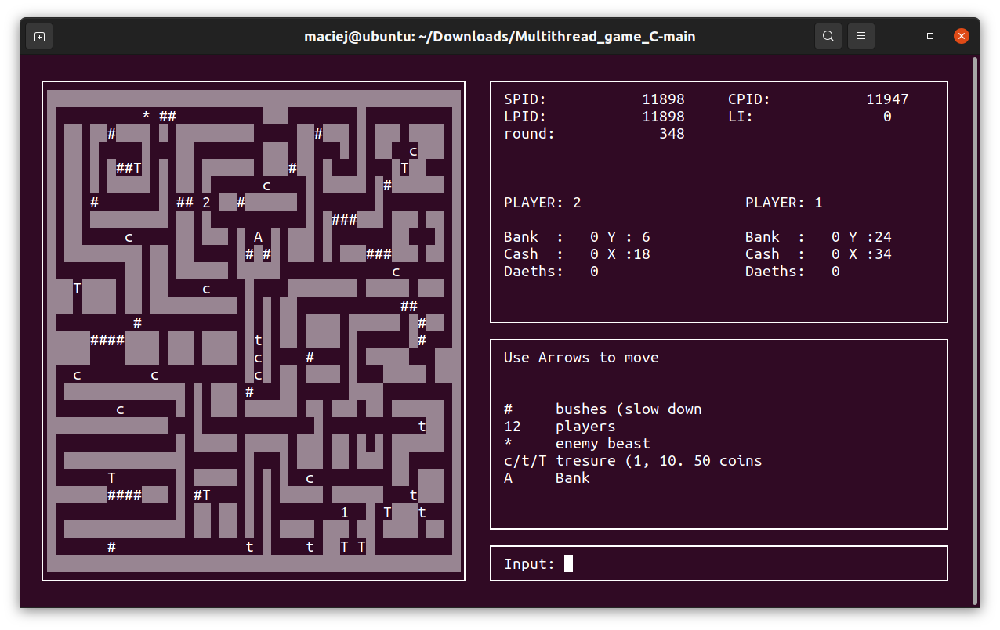
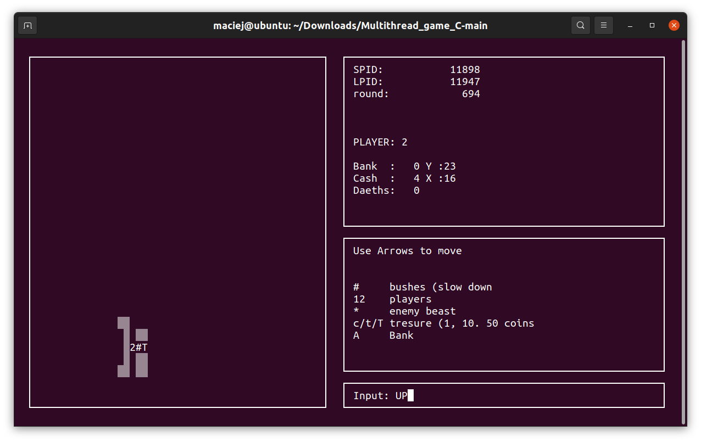
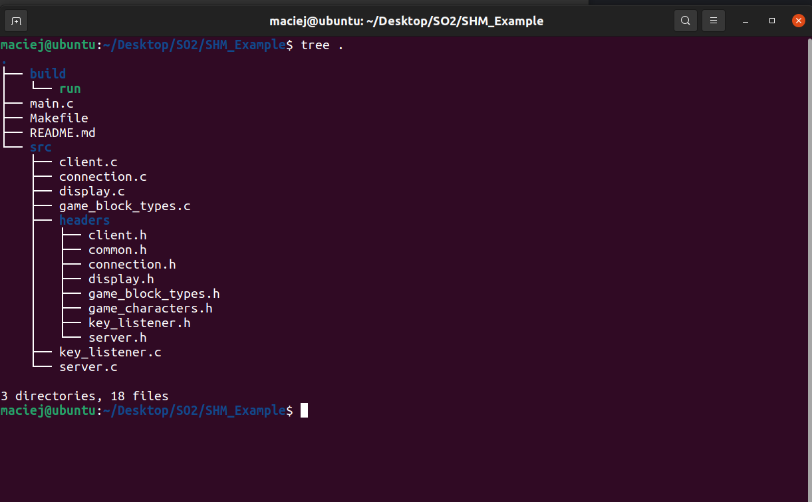

# Multithreaded terminal game in C
Player is locked in a maze and their task is to collect treasures in the form of coins (c, t, T). If player collects enough treasures takes them to the BANK ( A ) and leaves them there. A player may carry any number of coins at a time (carried), but may lose . The beast chases the player when it comes within range.

## Blocks on the map
* '*' is beast
* '1', '2' are players
* '▒' block is the wall. Wall block players and beast
* \'#' block stop player move
* 'A' block is bank
* (c, t, T) are treasures

## Navigation
* navigate using arrows


### Server preview:

### Client preview (client see only part of the map):


## Main Goal
    
    the game was made to practice: 
     * synchronization of data access
     * communication between processes
     * synchronization and work with many threads

## Technology
    * ncurses       ->  GUI
    * shared memory ->  Data transfer beetwen proccesses
    * semaphores    ->  Sync memory access
    * mutex         -> to sync beast thread

## RUN
Use make command to build and run. 1st game instanction will be mark as server, 2nd as client. 

## REQUIREMENTS:
* min terminal size: 32 row, 110 col
* xterm
* ncurses

Before run install: xterm # to resize terminal size ncurses # to display windows in terminal

#### Install before compilation (on ubuntu):
```
    sudo apt install xterm
    sudo apt-get install libncurses5-dev libncursesw5-dev
```


#### To clear terminal mesh after game crash use:
    stty sane
    if {ENTER} dosnt work use: stty sane ^J {CTRL + J}

#### Good for debug:
    watch -n 1 ls /dev/shm
    rm /dev/shm/C_SAVE_SHM /dev/shm/sem.C_SAVE_SEM /dev/shm/S_SAVE_SHM /dev/shm/sem.S_SAVE_SEM


## File structure preview
